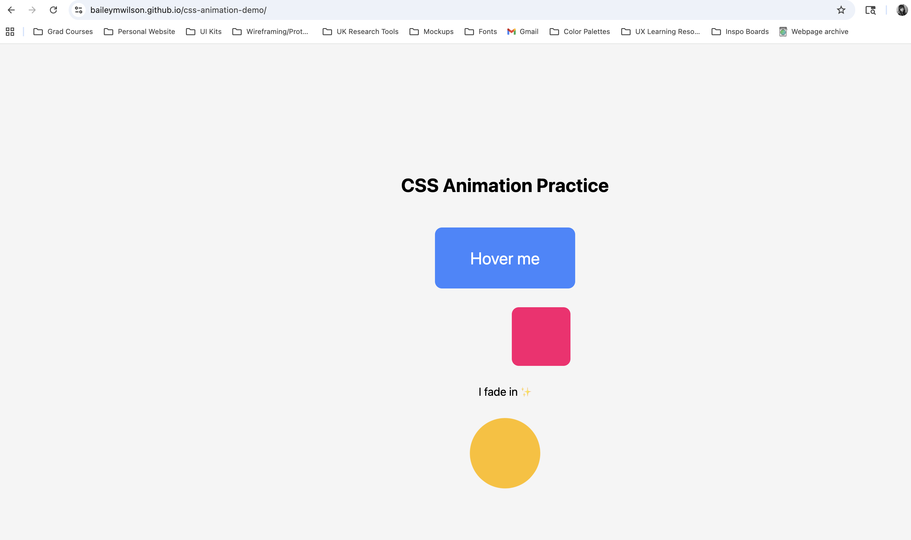
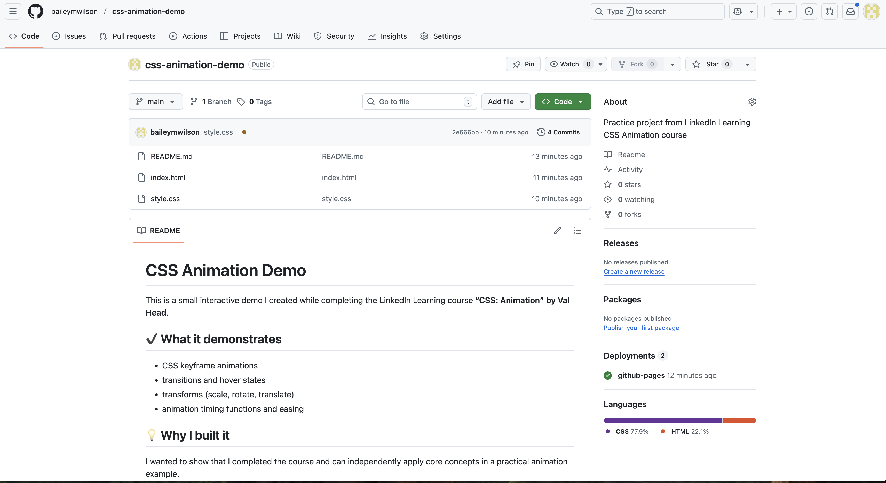
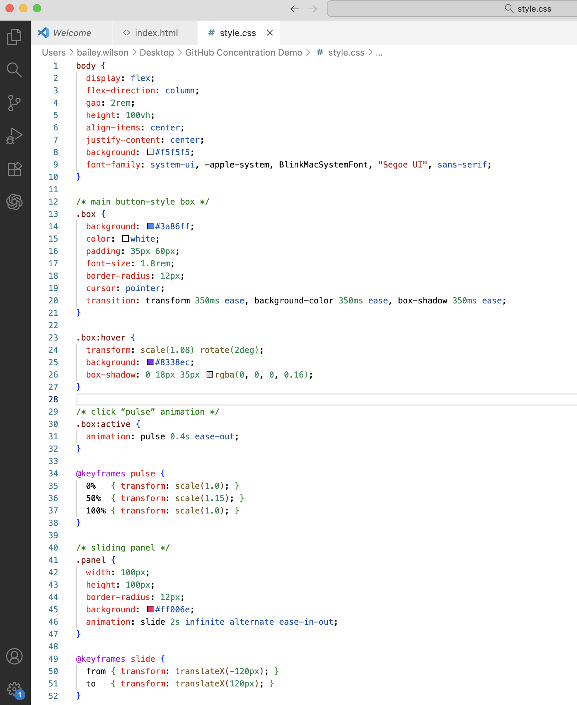
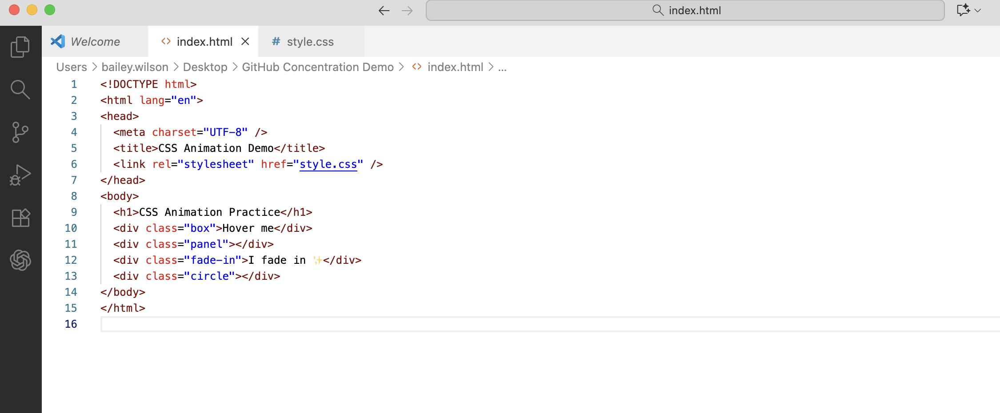

# CSS Animation Demo

This is a small interactive demo I created while completing the LinkedIn Learning course **“CSS: Animation” by Val Head**.

## ✔️ What it demonstrates
- CSS keyframe animations
- transitions and hover states
- transforms (scale, rotate, translate)
- animation timing functions and easing

## 💡 Why I built it
I wanted to show that I completed the course and can independently apply core concepts in a practical animation example.

## 🌐 Live Link
https://baileymwilson.github.io/css-animation-demo/

## 🛠 Tech Used
- HTML
- CSS
- GitHub Pages for deployment

## Screenshots

### Live Website

### GitHub Repository

### VS Code – style.css

### VS Code – index.html

